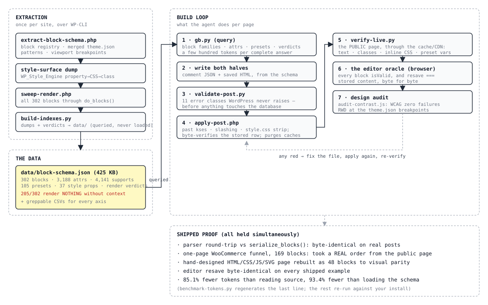

# gutenberg-headless

**Build WordPress block-editor pages in seconds. No visual editor. No guessing.**

An [Agent Skill](https://platform.claude.com/docs/en/agents-and-tools/agent-skills/overview)
for Claude Code that writes Gutenberg pages three ways:

### Three Ways to Build

| Method | Input | Output | Proof |
|--------|-------|--------|-------|
| **Vibe Code** | `"dark hero + cards + FAQ + checkout"` | post_content, published | a live one-pager that took a real order |
| **HTML Convert** | any hand-written HTML/CSS/JS/SVG page | the same page as blocks | rebuilt to visual parity, byte-canonical in the editor |
| **Schema Query** | `"what can core/group do?"` | attrs, supports, presets, verdicts | free, instant, from measured data |

Just describe. The agent looks everything up, validates both halves, writes,
then proves it — on the public URL **and** inside the editor itself.

---

The complete block-editor authoring surface of a live site as a queryable
database — and every claim verified by rendering, resaving, and measuring,
because WordPress stores broken markup without a word of complaint.

```
302 block types · 3,188 attributes · 4,141 support flags · 105 preset slugs
37 style-engine properties · 86 patterns · the theme.json viewport breakpoints
205 of 302 blocks measured to render NOTHING without context
```

English · [繁體中文](README.zh-TW.md)

---

## Quick Start (Pick One)

### Option A: Natural Language (Fastest)
```
You (in Claude Code chat):
  "One-page funnel: dark hero, benefit cards, testimonials, product + checkout on the same page"

Claude generates:
  page.html (serialized block markup, ready to write)

Write to WordPress:
  wp eval-file tools/apply-post.php new page.html "Title" page publish
```

### Option B: HTML to Blocks
```
You: paste a designed HTML/CSS/JS/SVG page

Claude:
  the same page as blocks - native attributes where they exist,
  per-block custom CSS where they don't, and an honest list of what can't map

Proof of concept shipped in this repo: examples/fidelity-target.html (hand-written)
vs examples/fidelity-blocks.html (48 blocks, visual parity, editor-canonical)
```

### Option C: Query the Schema (Full Control)
```
You: "Show me core/heading"

Claude (via gb.py):
  CONTENT-IN-HTML - sourced attrs live in the saved HTML, not the comment
  content     rich-text  IN-HTML selector:h1,h2,h3,h4,h5,h6
  textColor   slug-of:color-preset  class:has-text-color+has-{v}-color
  render-sweep: ... · parent: ... · supports: ...

You write markup with certainty, never guessing.
```

Result: pages that render for visitors, open clean in the editor, and survive
the next resave byte for byte.

---

## The Problem (Why This Exists)

### Silent failure, by design

A Gutenberg block is **two halves that WordPress never checks against each
other**. The comment JSON is what the *editor* reads; the saved HTML is what
the *visitor* gets:

```html
<!-- wp:paragraph {"backgroundColor":"accent"} -->
<p>hello</p>
<!-- /wp:paragraph -->
```

- Comment says background, HTML lacks the class → visitor sees nothing, editor shows it, **no error**
- Preset slug that doesn't exist on this site → the class lands, no CSS anywhere defines it, styles nothing
- Block the site doesn't register → raw HTML for visitors, a recovery dialog for editors
- Sourced attribute (`content`, `url`…) written into the comment → does nothing, silently
- Saved HTML that doesn't match `save()` → the block stays "valid" via a deprecation, and the next
  manual save **rewrites your markup and eats what it didn't recognize**

A page that is 90% right looks exactly like a page that is 100% right — until
a visitor sees no background, or an editor's save quietly deletes your work.

### The Solution

The authoritative surface — every block, attribute, support flag, preset and
style property — extracted from a live install and verified by rendering. Plus
the thing no schema can give you: a validator for the agreement *between the
two halves*, and a loop that treats the editor itself as the final oracle.

```bash
$ python tools/gb.py var "var:preset|spacing|60"
var:preset|spacing|60
  css: var(--wp--preset--spacing--60)
  = 2.25rem
```

## How it works



Three phases. **Extraction** runs once per site, over WP-CLI, and dumps the
block registry, the merged theme.json, and the style engine's own
property→CSS→class metadata. **Verification** pushes all 302 blocks through
`do_blocks()`, round-trips the parser against `serialize_blocks()`, and folds
the verdicts back into the data. **Query** is all an agent ever does at build
time — the 425 KB schema is queried, never loaded.

## Install

Via npm — no clone, no Python needed to install (Python is only used by the
skill's query/validation tools afterwards):

```bash
npx gutenberg-headless claude-code --global    # or: cursor, codex-cli, gemini-cli, ...
npx gutenberg-headless --list
```

Or from a clone (same platform configs, Python installer):

```bash
git clone https://github.com/Moksa1123/gutenberg-headless
cd gutenberg-headless
python tools/install-skill.py claude-code --global
```

8 platforms: Claude Code, Claude.ai, Cursor, Codex CLI, Gemini CLI, Devin
(ex-Windsurf), GitHub Copilot, Continue — the same verified platform
conventions as the sibling elementor-headless skill (each config carries its
`verifiedAsOf` date; they are checked, not assumed). Upgrades prune what the
previous version left behind. The agent picks it up as `gutenberg-headless`;
`SKILL.md` is the entry point.
Build-time steps 1–3 below are entirely local; steps 4–7 need WP-CLI on the
WordPress host (usually over SSH) and, for the editor oracle and design
audits, any browser-automation channel.

## Use

Install the skill, then describe the page to your agent. The skill teaches it
this loop:

```
1. query the surface      gb.py              which blocks exist HERE, their attrs,
                                             their families, their sweep verdicts
2. write the markup       (the agent)        both halves, from the schema
3. validate BEFORE write  validate-post.py   11 error classes WordPress won't raise
4. write over WP-CLI      apply-post.php     past kses + slashing + the style.css
                                             strip filter; byte-verifies the row;
                                             purges the caches
5. verify the live page   verify-live.py     the public URL, through the page cache
6. ask the editor itself  (browser console)  every block isValid, and
                                             serialize(getBlocks()) === stored content
7. audit the design       audit-contrast.js  WCAG contrast, zero failures required
                          + the RWD checklist  at the theme.json breakpoints
```

The queries the agent leans on — each answers completely in a few hundred tokens:

```bash
python tools/gb.py stats                        # what site, what's in here
python tools/gb.py blocks --grep cart           # find a block
python tools/gb.py blocks --static --top-level  # what stands alone as written HTML
python tools/gb.py block core/group             # family, attrs, supports, verdict
python tools/gb.py block heading --grep color   # filter one block's attrs
python tools/gb.py supports core/image          # the flattened supports tree
python tools/gb.py presets color                # every slug + its CSS var + value
python tools/gb.py styles                       # is-style-* variations
python tools/gb.py patterns --grep hero         # registered patterns
python tools/gb.py var "var:preset|color|x"     # expand a ref, check it exists
python tools/gb.py skeleton                     # a minimal valid page
python tools/gb.py grammar                      # the serialization cheat sheet
```

Then build, check, ship:

```bash
python tools/gb.py skeleton > page.html
python tools/validate-post.py page.html
wp eval-file tools/apply-post.php new page.html "Title" page publish
python tools/verify-live.py page.html https://your-site/slug/
```

- `validate-post.py` catches what WordPress won't: unregistered blocks, unknown
  attributes (with the JS-injected ones the server registry can't see correctly
  downgraded to warnings), enum and type violations, sourced attrs in the wrong
  half, preset slugs that don't exist on this site, every class and inline rule
  the comment promises but the HTML lacks, parent/ancestor violations, content
  blocks with no content.
- `apply-post.php` exists because the write path itself lies: WP-CLI has no
  user, so kses filters are armed **and** a separate `content_save_pre` filter
  strips per-block custom CSS. It disarms both, slashes, writes, **reads the
  row back and byte-compares it against your file**, then purges the object
  and page caches between the database and the visitor.
- `verify-live.py` fetches the public URL plus every same-host stylesheet and
  asserts text, classes, inline rules and preset-var definitions against the
  delivered bytes — aware that fluid typography rewrites your `font-size`
  into a `clamp()` whose maximum is the authored value.

## Not every block exists on every install

**The block surface is a property of the SITE, not of WordPress.** The
extraction site registers 302 block types: 116 `core/*`, 165 `woocommerce/*`,
13 from the theme, the rest from plugins. A bare WordPress has ~116. Ask a
generic schema about `woocommerce/product-price` and it answers confidently
about a block your site may not have.

And `is_dynamic` misleads — 272 of 302 carry a render callback, including
`core/heading`. The classifier that matters is where the content lives:

| family | count | you write |
|---|---|---|
| content-in-HTML (sourced attrs) | 28 | comment + the full saved HTML |
| static wrapper | 14 | comment + wrapper HTML |
| pure dynamic | 260 | a void comment — attrs are everything |

With the killer number attached to every block by the sweep: **205 of 302
render NOTHING on a bare page** — they need a product, a post, a cart, a query
loop. `gb.py block <name>` says so before you publish an invisible page.

## Token cost, and time

**85.1% fewer tokens than reading the WordPress source. 93.4% fewer than
loading the schema. ~5× faster on model ingest.** Tool latency is measured
(median 241 ms per query); ingest time is derived from token counts at a
disclosed 1,000 tok/s reference rate — change the rate, the ratio does not
move. Reproduce it; the script writes `data/token-benchmark.csv`:

```bash
pip install tiktoken
python tools/benchmark-tokens.py --wp-src /path/to/wordpress
```

| Task | read source | load schema | **query** |
|---|---|---|---|
| Build a group section (layout, background, spacing presets) | 19,036 | 102,812 | **627** |
| Color + typography on a heading, with valid preset slugs | 13,855 | 102,812 | **1,132** |
| Every preset slug this site can use | 4,215 | 102,812 | **3,935** |
| Will woocommerce/product-price render here, inside what? | 433 | 102,812 | **383** |
| Which style key drives box-shadow, and the valid presets | 8,109 | 102,812 | **743** |
| **Total** | **45,648** | **102,812** | **6,820** |

Two rows barely save — and stay in the table. The preset task reads two
compact theme.json files (6.6% saved), and product-price's block.json is tiny
(11.5%) — but neither baseline can answer the half that fails silently: the
merged presets that plugin filters inject, and the bare-page render verdict
that lives in no file at all. The savings live where the source sprawls
(supports semantics: 96.7%) — and the correctness lives everywhere. Token
counts use tiktoken `cl100k_base` — OpenAI's tokenizer, not Claude's, so
absolute counts shift by roughly ±10%; ratios under one tokenizer are stable,
and the ratio is the claim.

## Is it accurate? Make it prove it.

Don't trust it — test it. Every check reads a different artefact: the parser's
bytes, `do_blocks()` output, the delivered page, the editor's own resave, a
real browser's computed styles, the order table in the database.

**1. Does the parser match WordPress's?**
`blockmark.py` round-tripped against `serialize_blocks(parse_blocks(...))`
over real posts from the live site: byte-identical, with the one divergence
being the server's own `{}`→`[]` empty-object normalization — documented, not
hidden.

**2. Does every block render what the schema claims?**
All 302 registered blocks pushed through `do_blocks()` in void form, zero
errors: 69 render bare, 205 render nothing (need context), 28 are
content blocks. Verdicts ship in `data/render-verification.csv` and surface in
every `gb.py block` answer.

**3. Is the style surface the engine's, or a human's recollection?**
`data/style-surface.json` is `WP_Style_Engine::BLOCK_STYLE_DEFINITIONS_METADATA`
dumped from the site itself — 37 properties with their CSS, their preset vars,
their classnames. The save-time vs render-time split was then **measured
property by property**: what the editor's `getSaveContent` emits versus what
the server injects at render. Two properties the PHP engine lacks but the JS
engine serializes (`textShadow`, `outline.*`) are shipped as a measured
supplement, labelled as such.

**4. Does the editor itself accept the markup — byte for byte?**
The bar for every shipped example: open in wp-admin, every block `isValid`,
and `wp.blocks.serialize(getBlocks()) === stored content`. The one-page
funnel holds it at 169 blocks — including `<style>`/`<script>` layers, a
verbatim 48-block WooCommerce checkout skeleton, and every canonicalization
rule that iterating to `identical:true` surfaced (attribute key order follows
the client registry; `alignfull` flips `id`/`class` order; a `<tr>` cannot
carry a custom class; the editor's resave is the oracle, queried not argued
with — full list in [canonicalization.md](references/canonicalization.md)).

**5. Does the page the PUBLIC gets contain all of it?**
`verify-live.py` fetches through the page cache and asserts every text
fragment, class, inline rule and preset-var definition — 356 assertions green
on the funnel page. It prints the cache headers so a stale edge is visible
rather than silent.

**6. Does the design survive measurement?**
`audit-contrast.js` computes WCAG contrast in the live page — walking
ancestors for real backgrounds, checking **every stop of a gradient**,
blending cover-block dim overlays, treating star glyphs as graphics. Its first
run found 15 real failures on a page that "looked fine" (a theme's `h1` color
beating inheritance on a dark hero among them); the requirement is zero. RWD
is verified at the theme.json breakpoints: no horizontal overflow, grids
collapse, `@mobile` state styles compute, `blockVisibility` hides.

**7. Does commerce actually work?**
The one-pager took a real order from the public page: add to cart → same-page
block checkout → Taiwan address fields in the right order → offline gateway →
**order row in the database** with billing complete. The failure that preceded
it (a plugin's checkout field never rendering off the checkout page) is
documented with its fix in [woo-onepage.md](references/woo-onepage.md).

## The traps

Each of these was hit while building this repo — each is now a validator rule,
a tool behaviour, or a documented recipe:

1. Sourced attributes written into the comment do nothing — content lives in
   the HTML half
2. `is_dynamic` doesn't mean what it sounds like; 272/302 blocks carry a callback
3. WP-CLI writes get mangled twice: kses (no user → filters armed) and
   `wp_update_post`'s unslash eating your attr escapes
4. Per-block custom CSS has a **third** stripper: `content_save_pre` deletes
   `style.css` for users without `edit_css` — WP-CLI included
5. A deprecated form stays "valid" while the next save rewrites it — write the
   canonical current form (`textAlign` → `style.typography.textAlign`,
   `fitText` needs `has-fit-text` or the editor eats the attribute)
6. Save-time vs render-time: write `has-*` classes yourself, never
   `wp-container-*`/`wp-elements-*`/`wp-states-*` — the server injects those
7. Per-block custom CSS compiles to `:root :where(...)` — specificity (0,1,0)
   **by design**; it cannot out-rank a plugin's `!important`. The page-level
   `<style>` layer is the escape hatch
8. Fluid typography rewrites your inline `font-size` to `clamp()` at render —
   the stored bytes and the delivered bytes legitimately differ
9. `is_checkout()` is false on a page carrying the checkout block —
   conditionally-registered checkout fields silently don't render while their
   server-side validation still rejects the order
10. The server registry can't see JS-injected attributes, client-registered
    variations, or `save()` itself — the editor console is the only oracle for
    those, and the skill's loop queries it instead of guessing
11. PHP normalizes `{}` to `[]` on any server-side resave; the editor doesn't

Full write-ups: [extraction-traps.md](references/extraction-traps.md) ·
[canonicalization.md](references/canonicalization.md) ·
[wp71-new-surface.md](references/wp71-new-surface.md) ·
[woo-onepage.md](references/woo-onepage.md)

## What's in the box

```
data/
  block-schema.json          the full surface - queried, never loaded (425 KB)
  style-surface.json         the style engine's own property→CSS→class metadata
  blocks.csv                 one row per block type, with render verdicts
  attributes.csv             every (block, attribute) pair - 3,188 rows, greppable
  supports.csv               every support flag, flattened - 4,141 rows
  presets.csv                every preset slug + CSS var + value + origin
  render-verification.csv    per-block: what do_blocks() actually produced
  styles.csv · patterns.csv · block-categories.csv

tools/
  gb.py                      query the schema - the front door
  blockmark.py               parse/serialize, round-trip faithful (also a library)
  validate-post.py           pre-flight both halves of every block
  apply-post.php             write past kses/slashing/strip-filters, byte-verify, purge
  verify-live.py             the public URL, through the cache, fluid-aware
  audit-contrast.js          in-page WCAG contrast audit (gradients, cover dims, symbols)
  extract-block-schema.php   dump a live site's full surface
  sweep-render.php           render all blocks, record who shows nothing
  build-indexes.py           dumps + sweeps -> shipped data

references/  data-model · supports-and-styles · dynamic-blocks · canonicalization
             wp71-new-surface · woo-onepage · fidelity · extraction-traps
examples/    demo-page.html          the first proof page (editor byte-identical)
             wp71-features.html      WP 7.1's new surface, exercised and verified
             fidelity-target.html    a hand-designed HTML/CSS/JS/SVG page...
             fidelity-blocks.html    ...rebuilt as 48 blocks to visual parity
             onepage-woo.html        the 169-block funnel that took a real order
```

## Honest limits

- **`data/` describes the extraction site** (WP 7.1, Blocksy, WooCommerce).
  It ships as a working example; re-extract before trusting a single slug on
  your own install.
- **The editor's `save()` and deprecations live only in JS.** The validator
  enforces their rules; the editor console loop is the final arbiter. No
  server-side tool can replace it, so the skill budgets for it instead of
  pretending otherwise.
- **No per-block custom JS exists in WordPress core.** Interactivity comes
  from core's interactive blocks (tabs, accordion, details, lightbox, fitText)
  or from one deliberate `<html>`-block behaviour layer — a pattern this repo
  uses and documents, not a WordPress feature.
- **Version-bound**: every number here was measured on WordPress 7.1. New
  versions can invalidate any of it — which is why the extractors and sweeps
  ship and re-run against *your* install.
- The WooCommerce checkout skeleton is copied verbatim from the site's own
  checkout page, never hand-composed — 48 nested blocks with their own
  conventions is the plugin's territory, and the recipe says so.

## Regenerate for your install

```bash
wp eval-file tools/extract-block-schema.php > dump.json
wp eval-file tools/sweep-render.php > render-sweep.json
python tools/build-indexes.py dump.json --out data/ --render-sweep render-sweep.json
python tools/gb.py stats      # confirm it now describes YOUR site
```

Also dump the style surface (`tools` include the eval-file for
`BLOCK_STYLE_DEFINITIONS_METADATA`) whenever you move major WordPress versions
— the 7.0/7.1 delta added block-level states, visibility, and per-block custom
CSS, none of which an older dump knows.

## License

MIT. Built and maintained by **moksa** · [moksaweb.com](https://moksaweb.com)

Sibling skills: [elementor-headless](https://github.com/Moksa1123/elementor-headless) ·
[rankmath-seo-wp](https://github.com/Moksa1123/rankmath-seo-wp)
